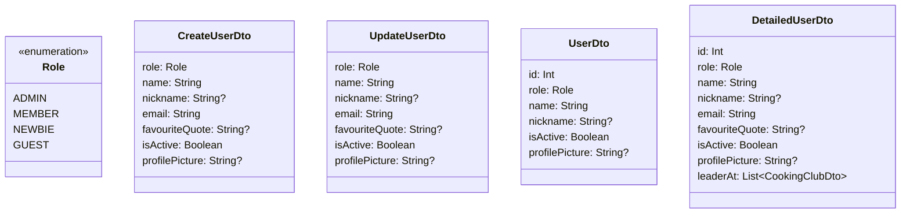
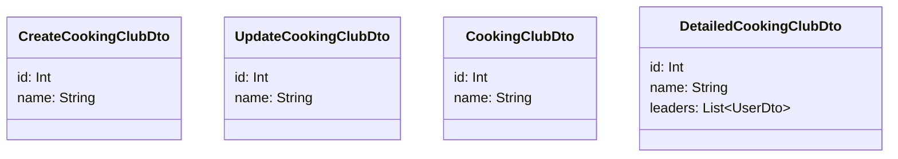
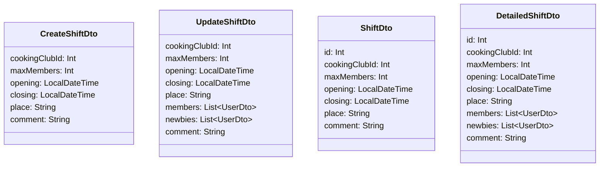
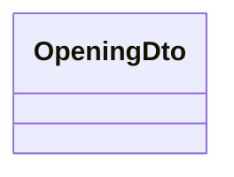
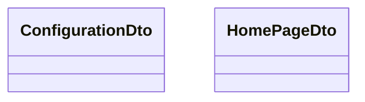

# Upgrade backend to use DTOs

## User

```mermaid
classDiagram

class Role {
    <<enumeration>>
    ADMIN
    MEMBER
    NEWBIE
    GUEST
}

class CreateUserDto {
    role: Role
    name: String
    nickname: String?
    email: String
    favouriteQuote: String?
    isActive: Boolean
    profilePicture: String?
}

class UpdateUserDto {
    role: Role
    name: String
    nickname: String?
    email: String
    favouriteQuote: String?
    isActive: Boolean
    profilePicture: String?
}

class UserDto {
    id: Int
    role: Role
    name: String
    nickname: String?
    isActive: Boolean
    profilePicture: String?
}

class DetailedUserDto {
    id: Int
    role: Role
    name: String
    nickname: String?
    email: String
    favouriteQuote: String?
    isActive: Boolean
    profilePicture: String?
    leaderAt: List&lt;CookingClubDto&gt;
}
```

## Cooking Club

```mermaid
classDiagram

class CreateCookingClubDto {
    id: Int
    name: String
}

class UpdateCookingClubDto {
    id: Int
    name: String
}

class CookingClubDto {
    id: Int
    name: String
}

class DetailedCookingClubDto {
    id: Int
    name: String
    leaders: List&lt;UserDto&gt;
}
```

## Shift

```mermaid
classDiagram

class CreateShiftDto {
    cookingClubId: Int
    maxMembers: Int
    opening: LocalDateTime
    closing: LocalDateTime
    place: String
    comment: String
}

class UpdateShiftDto {
    cookingClubId: Int
    maxMembers: Int
    opening: LocalDateTime
    closing: LocalDateTime
    place: String
    members: List&lt;UserDto&gt;
    newbies: List&lt;UserDto&gt;
    comment: String
}

class ShiftDto {
    id: Int
    cookingClubId: Int
    maxMembers: Int
    opening: LocalDateTime
    closing: LocalDateTime
    place: String
    comment: String
}

class DetailedShiftDto {
    id: Int
    cookingClubId: Int
    maxMembers: Int
    opening: LocalDateTime
    closing: LocalDateTime
    place: String
    members: List&lt;UserDto&gt;
    newbies: List&lt;UserDto&gt;
    comment: String
}
```

## Opening

```mermaid
classDiagram

class OpeningDto {

}
```

## Config

```mermaid
classDiagram

class ConfigurationDto {

}

class HomePageDto {

}
```
