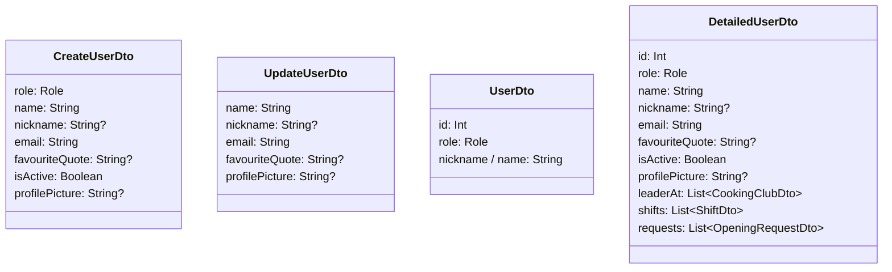
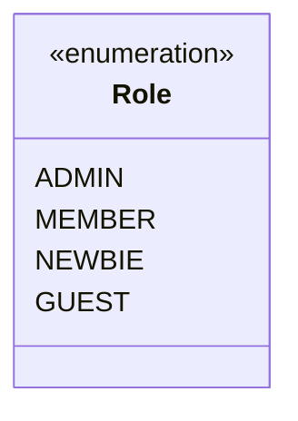
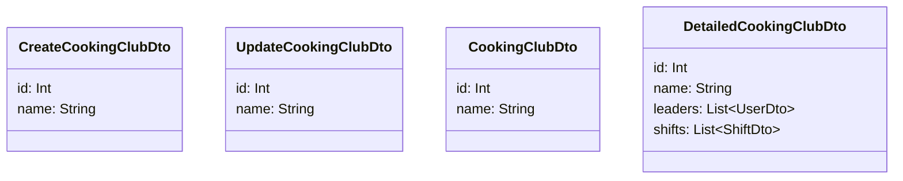
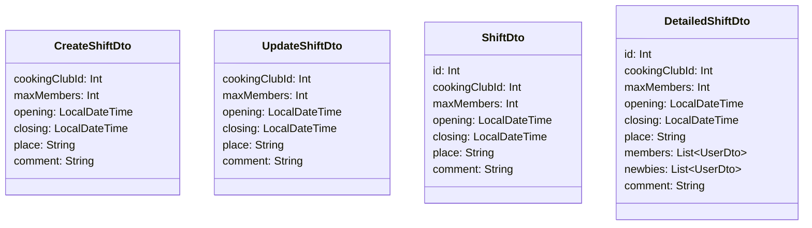
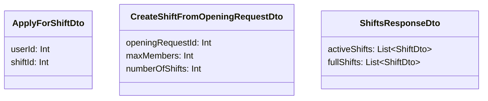
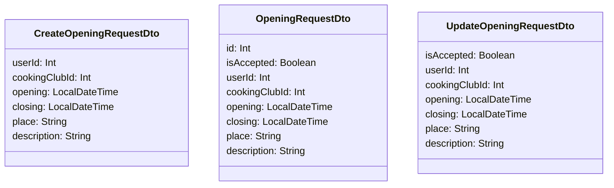
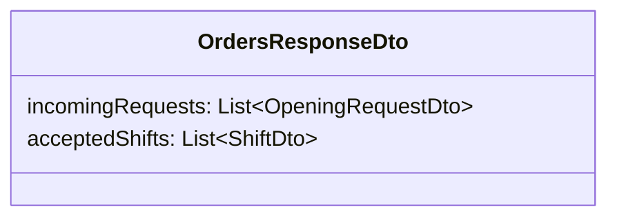
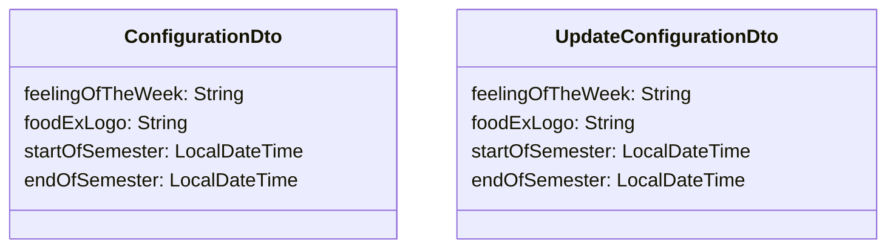
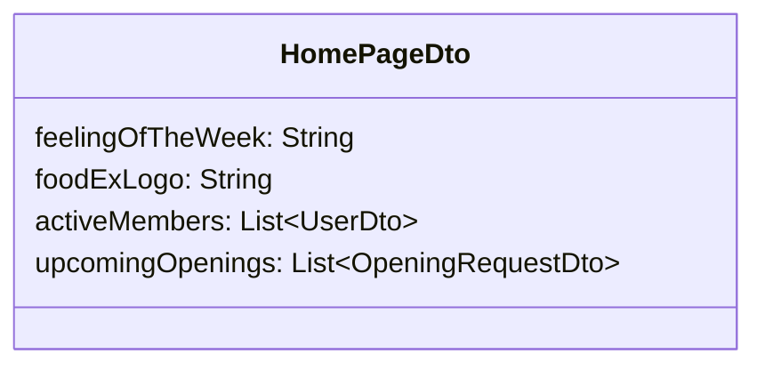

# Upgrade backend to use DTOs

## User

```mermaid
classDiagram

class CreateUserDto {
    role: Role
    name: String
    nickname: String?
    email: String
    favouriteQuote: String?
    isActive: Boolean
    profilePicture: String?
}

class UpdateUserDto {
    name: String
    nickname: String?
    email: String
    favouriteQuote: String?
    profilePicture: String?
}

class UserDto {
    id: Int
    role: Role
    nickname / name: String
}

class DetailedUserDto {
    id: Int
    role: Role
    name: String
    nickname: String?
    email: String
    favouriteQuote: String?
    isActive: Boolean
    profilePicture: String?
    leaderAt: List&lt;CookingClubDto&gt;
    shifts: List&lt;ShiftDto&gt;
    requests: List&lt;OpeningRequestDto&gt;
}
```

### Role

```mermaid
classDiagram

class Role {
    <<enumeration>>
    ADMIN
    MEMBER
    NEWBIE
    GUEST
}
```

## Cooking Club

```mermaid
classDiagram

class CreateCookingClubDto {
    id: Int
    name: String
}

class UpdateCookingClubDto {
    id: Int
    name: String
}

class CookingClubDto {
    id: Int
    name: String
}

class DetailedCookingClubDto {
    id: Int
    name: String
    leaders: List&lt;UserDto&gt;
    shifts: List&lt;ShiftDto&gt;
}
```

## Shift

```mermaid
classDiagram

class CreateShiftDto {
    cookingClubId: Int
    maxMembers: Int
    opening: LocalDateTime
    closing: LocalDateTime
    place: String
    comment: String
}

class UpdateShiftDto {
    cookingClubId: Int
    maxMembers: Int
    opening: LocalDateTime
    closing: LocalDateTime
    place: String
    comment: String
}

class ShiftDto {
    id: Int
    cookingClubId: Int
    maxMembers: Int
    opening: LocalDateTime
    closing: LocalDateTime
    place: String
    comment: String
}

class DetailedShiftDto {
    id: Int
    cookingClubId: Int
    maxMembers: Int
    opening: LocalDateTime
    closing: LocalDateTime
    place: String
    members: List&lt;UserDto&gt;
    newbies: List&lt;UserDto&gt;
    comment: String
}
```

### Shift optional?

```mermaid
classDiagram

class ApplyForShiftDto {
    userId: Int
    shiftId: Int
}

class CreateShiftFromOpeningRequestDto {
    openingRequestId: Int
    maxMembers: Int
    numberOfShifts: Int
}

class ShiftsResponseDto {
    activeShifts: List&lt;ShiftDto&gt;
    fullShifts: List&lt;ShiftDto&gt;
}
```

## OpeningRequest

```mermaid
classDiagram

class CreateOpeningRequestDto {
    userId: Int
    cookingClubId: Int
    opening: LocalDateTime
    closing: LocalDateTime
    place: String
    description: String
}

class OpeningRequestDto {
    id: Int
    isAccepted: Boolean
    userId: Int
    cookingClubId: Int
    opening: LocalDateTime
    closing: LocalDateTime
    place: String
    description: String
}

class UpdateOpeningRequestDto {
    isAccepted: Boolean
    userId: Int
    cookingClubId: Int
    opening: LocalDateTime
    closing: LocalDateTime
    place: String
    description: String
}
```

### Orders response

```mermaid
classDiagram

class OrdersResponseDto {
    incomingRequests: List&lt;OpeningRequestDto&gt;
    acceptedShifts: List&lt;ShiftDto&gt;
}
```

## Configuration

```mermaid
classDiagram

class ConfigurationDto {
    feelingOfTheWeek: String
    foodExLogo: String
    startOfSemester: LocalDateTime
    endOfSemester: LocalDateTime
}

class UpdateConfigurationDto {
    feelingOfTheWeek: String
    foodExLogo: String
    startOfSemester: LocalDateTime
    endOfSemester: LocalDateTime
}
```

### Home page

```mermaid
classDiagram

class HomePageDto {
    feelingOfTheWeek: String
    foodExLogo: String
    activeMembers: List&lt;UserDto&gt;
    upcomingOpenings: List&lt;OpeningRequestDto&gt;
}

```
